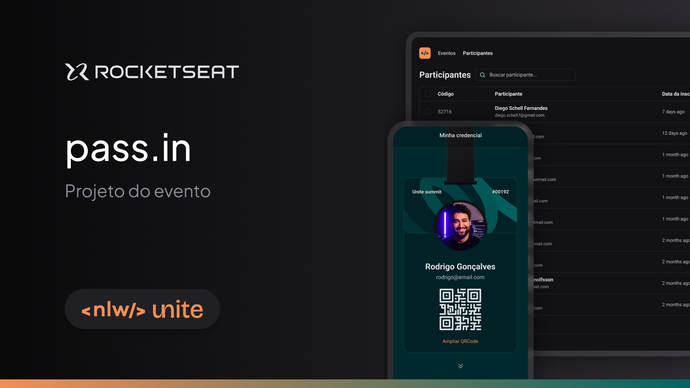
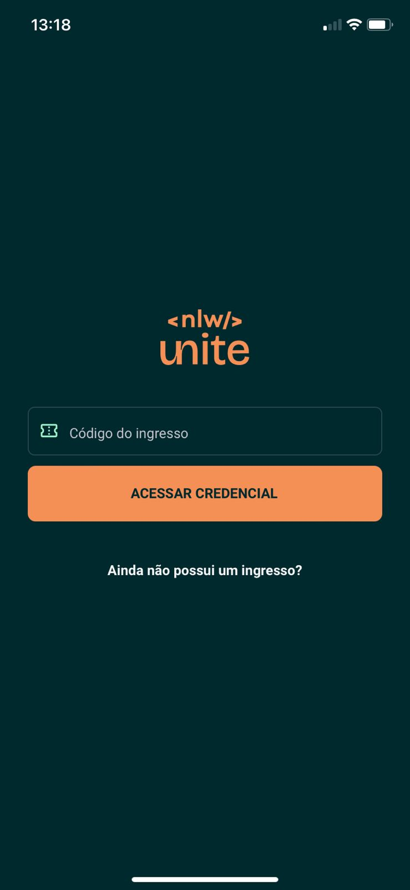
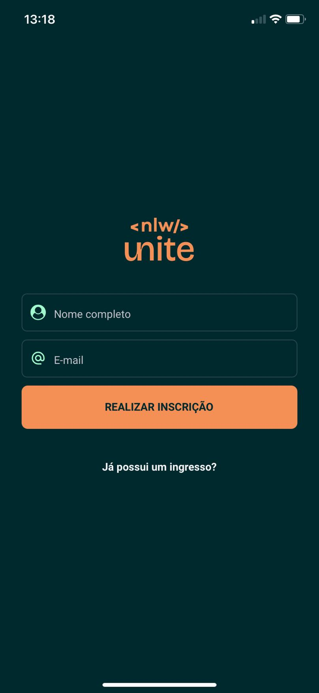
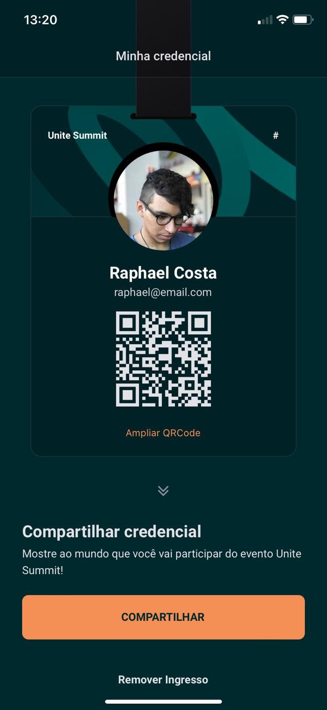
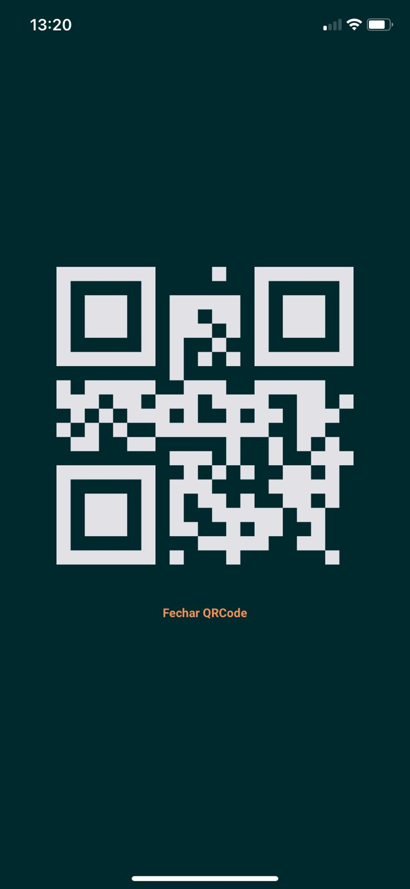
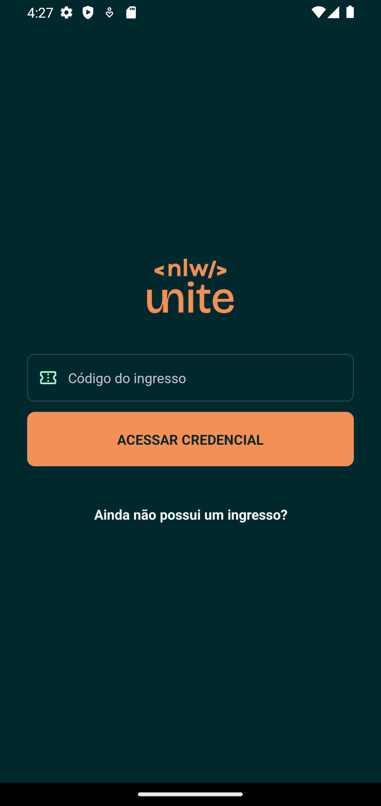
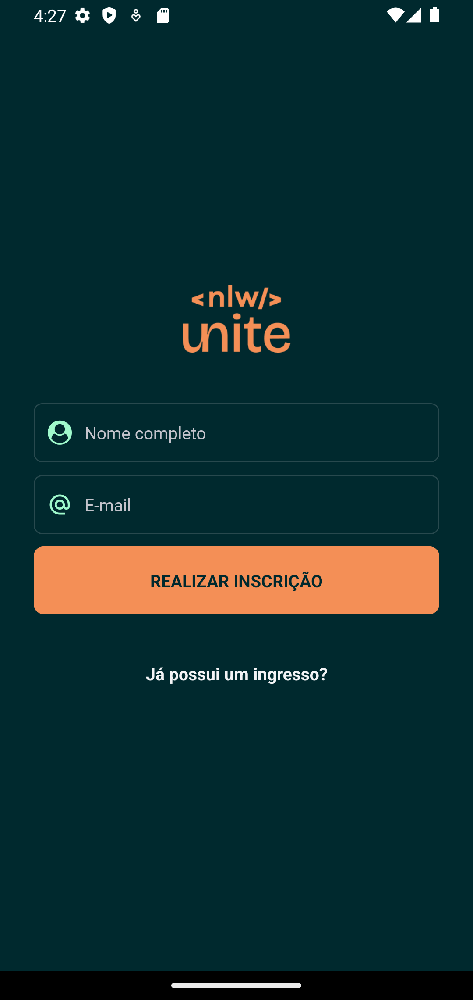
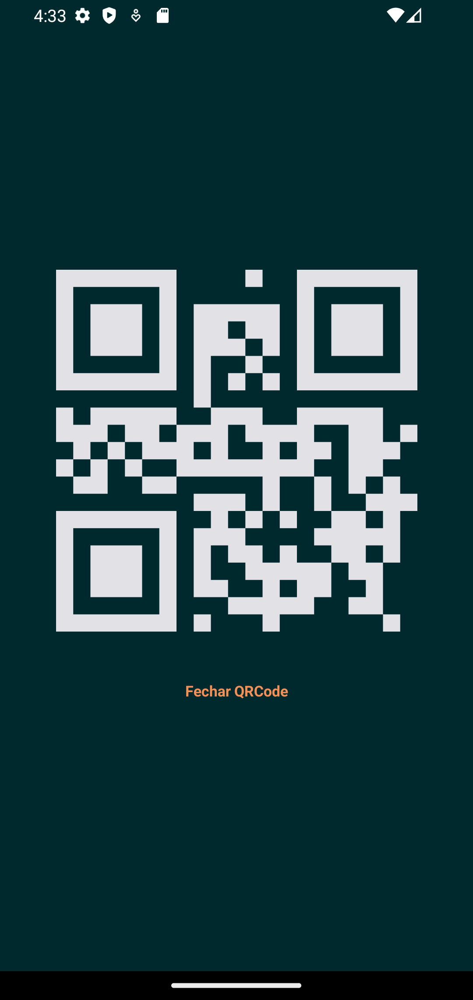

  

    
  

  
  
  
  

    
    
    <h2>
      Made with 💜
    </h2>
  

# 📷 Screenshots

## IOS

  
  
  
  

## Android

  
  
  
  

# 🚀 Running 

 To run this application, clone this repository by: `$ git clone https://github.com/raphaacosta/pass-in-mobile`.
 - Install the dependencies by: `$ npm install`.
 - If you want to run into your physical phone, then install Expo app into it.
 - Run `$ npx expo start` wait for the browser open, scan the QRCode with Expo app.
 - On the odther hand, if you wnat to run into a simulator, click on `run on IOS simulator` or `run on Android simulator`.

# 📌 Techs

 - [Npm](https://nodejs.org/en)
 - [Typescript](https://www.typescriptlang.org/)
 - [React Native](https://reactnative.dev/)
 - [Native wind](https://www.nativewind.dev/)
 - [Expo](https://expo.dev/)
 - [Zustand](https://zustand.docs.pmnd.rs/)